Відкриваючи додаток, користувач потрапляє на сторінку з формою для введення логіну та паролю (рис. 14). Авторизація відбувається за email’ом. Якщо пошта введена невірно, то ми отримуємо повідомлення про те, що пошта введена невірно. Якщо пароль введено невірно, то ми отримуємо повідомлення про те, що пароль введено не вірно.
Паролі попередньо введені менеджером з персоналу. Він може встановить пароль або змінить його на сторінці редагування кожного окремого працівника. Залогінитися можуть лише менеджери (керівники) департаментів та менеджер з персоналу, головний користувач додатку. Для менеджерів департаментів та менеджера з персоналу відкриваються різні сторінки. Керівники департаментів мають обмежений функціонал, тоді як менеджеру з персоналу доступні всі функції додатку. 

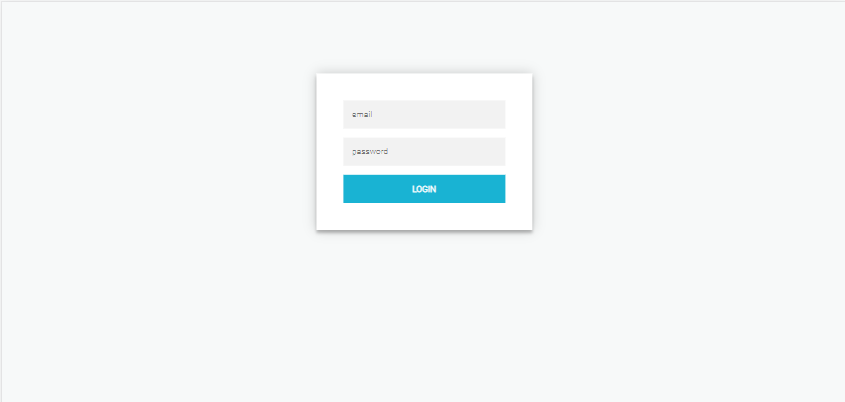

Рис. 14 – Сторінка авторизації

Після успішної авторизації, користувач, якщо це менеджер з персоналу, потрапляє на головну сторінку (рис. 16),  якщо це керівник департаменту – на сторінку свого департаменту (рис. 15).  На бічній панелі він бачить своє ім’я та фото. На сторінці виведені всі співробітники компанії з вказанням ім’я, прізвища, номером телефона, поштою, посадою та департаментом до якого вони належать (якщо користувач – керівник департаменту, то він бачить лише працівників свого департаменту). 

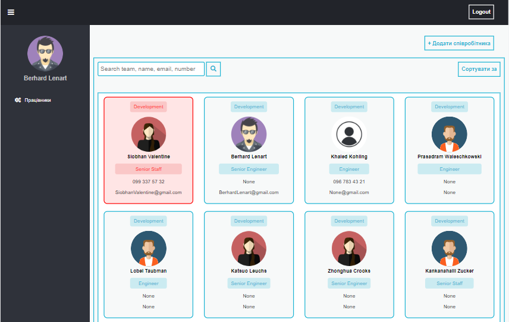

Рис. 15 – Головна сторінка керівника департаменту

Головна сторінка менеджера з персоналу має наступний вигляд:

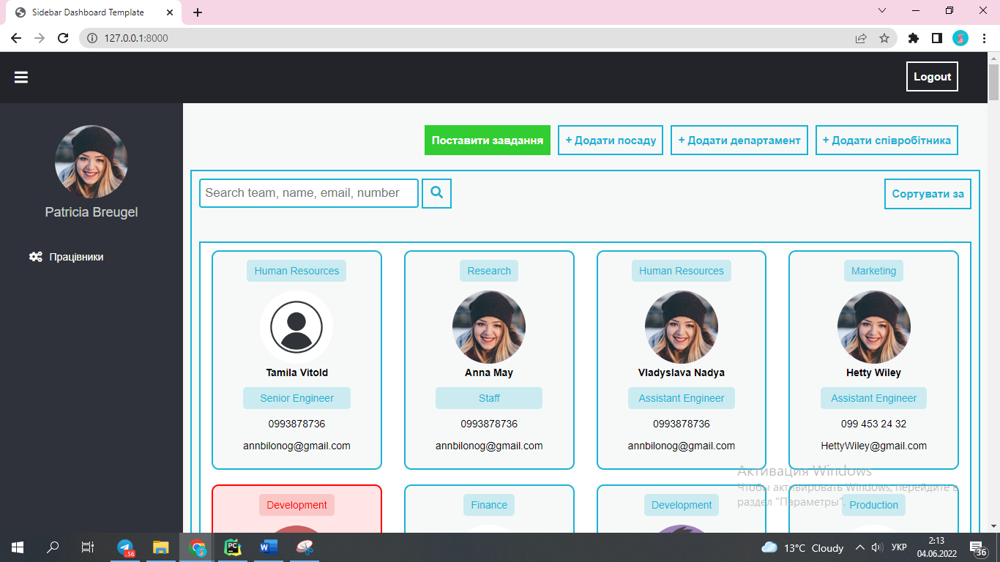

Рис. 16 – Головна сторінка

На головній сторінці є наступні кнопки:
- «Поставити завдання» - передбачається, що кожного дня менеджер з персоналу, заходячи на сторінку, одразу натискатиме її для того, щоб в базу даних вносилась інформація про поточні функції виконувані всіма працівниками. В подальшому на основі цих записів буде рахуватись функціональна стійкість організації.
- «+ Додати посаду» - кнопка при натисканні якої відкривається форма для внесення даних про нову можливу посаду (рис. 17);
- «+ Додати департамент» - кнопка при натисканні якої відкривається форма для внесення даних про новий можливий департамент (рис. 18);
- «+ Додати співробітника» - кнопка при натисканні якої відкривається форма для внесення даних про нового співробітника (рис. 19).

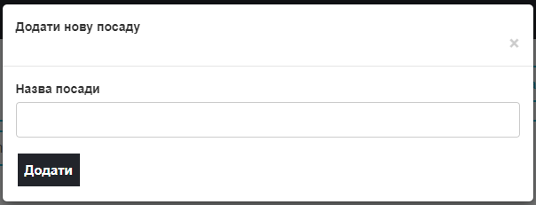

Рис. 17 – Форма додавання нової посади

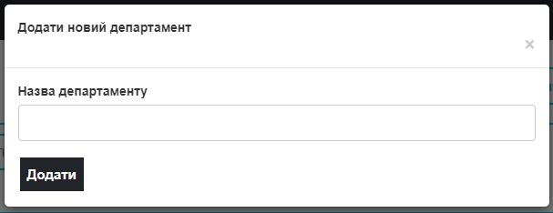

Рис. 18 – Форма додавання нового департаменту

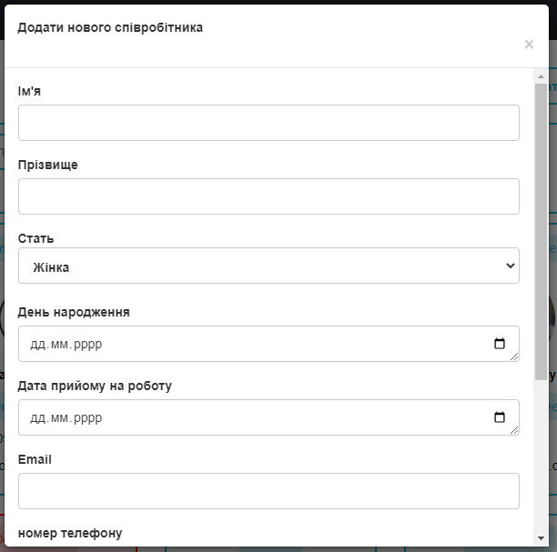

Рис. 19 – Форма додавання нового співробітника

На головній сторінці червоним кольором позначені співробітники, які можуть бути відсутніми поточного дня (до того як їм не знайдуть заміну, вони мають виконувати свої функції), а отже, яким потрібно знайти заміну (рис. 20).

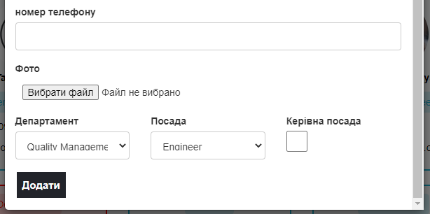

Рис. 20 – Червоним позначені працівники, яким потрібно знайти заміну

Сірим кольором позначені працівники, яким уже знайшли заміну.

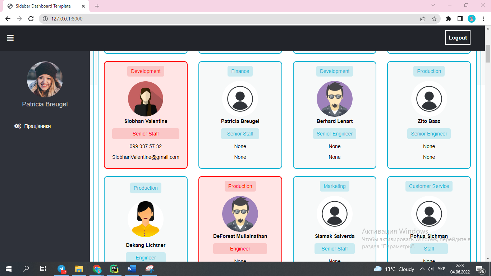

Рис. 21 – Сірим позначені працівники, яким знайшли заміну

При натисканні на співробітника відкривається модальне вікно з детальнішою інформацією та кнопками (рис. 22):

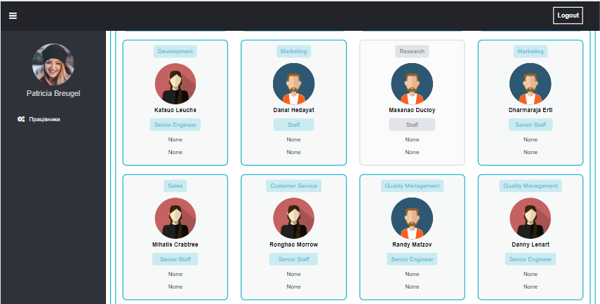

Рис. 22 – Модальне вікно з інформацією про працівника

Воно містить кнопку «Редагувати». Ця кнопка слугує для того, щоб відкривати нове вікно для редагування інформації про співробітника. При натисканні на цю кнопку відривається нова сторінка (рис. 23) – сторінка з детальною інформацією, історією роботи на посадах та департаментах, а також функції, які також можна редагувати:

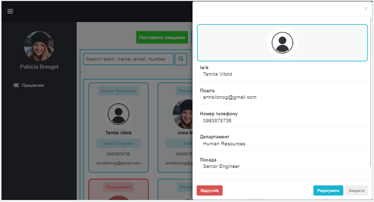

Рис. 23 – Сторінка редагування

Ця сторінка містить кнопки « Додати посаду», «Додати керівництво» та «Додати департамент». Принцип роботи їх однаковий, тому розглянемо одну з них, наприклад, «Додати посаду». При натисканні відкривається нове модальне вікно з формою (рис. 24). Воно містить два поля «Кінець», оскільки передбачається, що при зміні посади робота на попередній посаді зупиняється. Заповнимо цю форму та натиснемо кнопку «Додати» (рис. 25). Друге поле «Кінець» можна не заповнювати, перше – обов’язкове. Бачимо, що відбулися зміни (рис. 26). Аналогічно працюють інші кнопки.

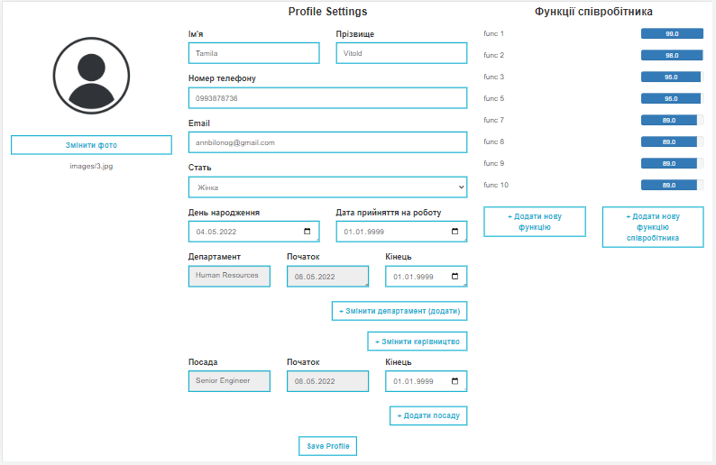

Рис. 24 – Форма для додавання нової посади

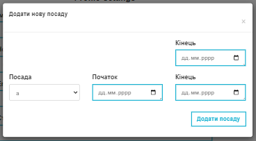

Рис. 25 – Заповнена форма

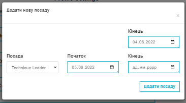

Рис. 26 – Оновлення сторінки

На модальному вікні при натисканні на співробітника також є кнопка «Відсутній» (рис. 22), вона є тільки у співробітників, які присутні поточного дня. Натискаючи на неї, відкривається нове модальне вікно (рис. 27). Тобто менеджер з персоналу, так само як і менеджери департаментів, може вносити інформацію про відсутність. При введенні поточної дати, працівник стане «червоним», тобто відсутнім (рис. 28).

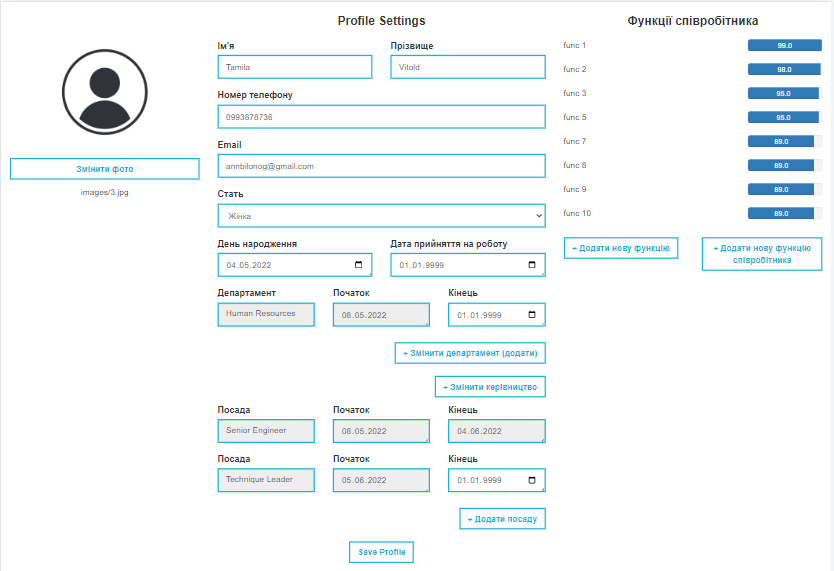

Рис. 27 – Форма відсутності

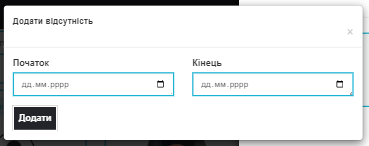

Рис. 28 – Робота кнопки «Відсутній»

	У працівників, які будуть відсутніми, замість кнопки «Відсутній» є кнопка «Знайти заміну» (рис. 29). 
	
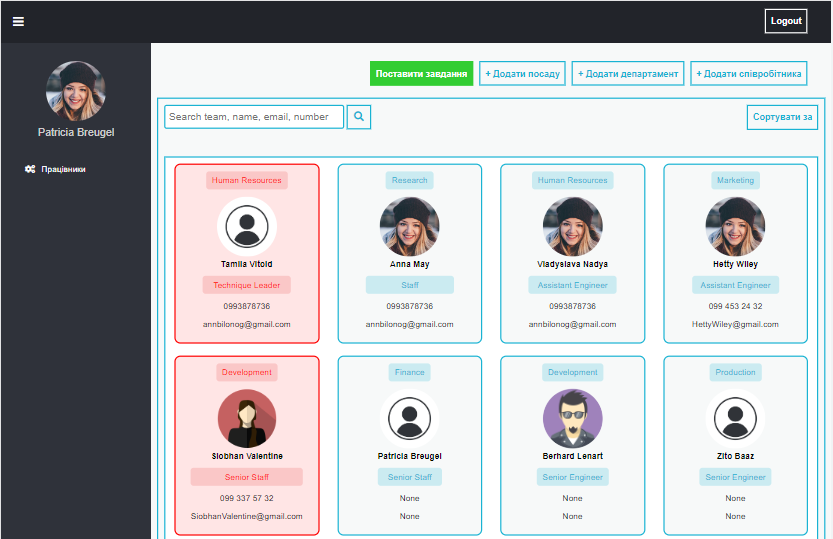	

Рис. 29 – Модальне вікно відсутнього працівника

При натисканні на кнопку «Знайти заміну» відкривається нове вікно для знаходження заміни працівнику (рис. 30). Натискання кнопки «Знайти заміну» запускає на виконання розроблений алгоритм підбору працівників для заміни, передаючи функції яким ми б отримали найменше економічних втрат. Отже, в результаті роботи алгоритму ми отримуємо три варіанти з яких можна обрати: не замінювати, замінити на одного, замінити на двох. Оскільки в даному випадку найкращий показник функціональної стійкості мати система, якщо функції відсутнього працівника передати двом працівникам, то варто обрати саме цей варіант. Після прийняття рішення обираємо потрібний варіант, натискаємо кнопку «Замінити», запис з новими функціями зберігається в базу даних в таблицю з поточними функціями працівників.

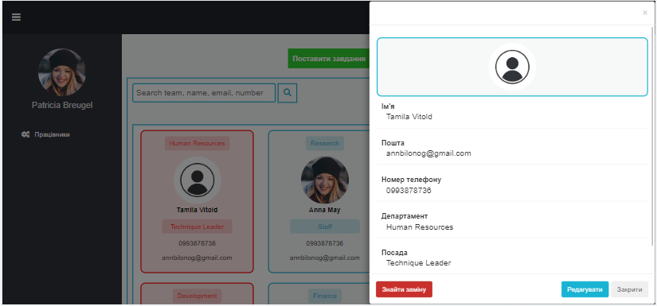

Рис. 30 – Варіанти заміни працівника

